<div align="center">

  <br />

  <h1>🚀 Data Structures & Algorithms</h1>
  
  <p>
    <strong>Efficient C++ Implementations of Core CS Concepts</strong>
  </p>

  <p>
    <a href="https://github.com/SMKanzuleman/DSA">
      
    </a>
    
    <a href="https://github.com/SMKanzuleman/DSA/stargazers">
      
    </a>
  </p>

</div>

---

## 🧠 **Repository Mindmap**

A visual overview of the algorithms and structures implemented in this repository:

```mermaid
graph TD;
    %% --- NODES ---
    DSA[🚀 Data Structures & Algorithms]
    
    %% Level 1
    DS[💾 Data Structures]
    ALGO[⚡ Algorithms]
    REC[🔄 Recursion]

    %% Level 2 - DS
    BST[Binary Search Tree]
    AVL[AVL Tree]

    %% Level 2 - Algo
    SORT[Sorting]
    MS[Merge Sort]
    QS[Quick Sort]

    %% Level 2 - Recursion
    TOH[Tower of Hanoi]

    %% Level 3 - Quick Sort Types
    QSL[Lomuto Partition]
    QSH[Hoare Partition]
    QSR[Randomized Pivot]

    %% --- CONNECTIONS ---
    DSA --> DS
    DSA --> ALGO
    DSA --> REC

    DS --> BST
    DS --> AVL

    ALGO --> SORT
    SORT --> MS
    SORT --> QS

    QS --> QSL
    QS --> QSH
    QS --> QSR

    REC --> TOH

    %% --- STYLING (Pro Neon Dark Theme) ---
    
    %% Root Node
    classDef root fill:#ff007f,stroke:#fff,stroke-width:4px,color:#fff,font-size:18px,font-weight:bold;
    class DSA root;

    %% Main Categories
    classDef cat fill:#2c3e50,stroke:#00d2ff,stroke-width:2px,color:#fff,font-weight:bold;
    class DS,ALGO,REC cat;

    %% Sub-Topics
    classDef sub fill:#0f5e55,stroke:#2ecc71,stroke-width:2px,color:#fff;
    class BST,AVL,SORT,TOH sub;

    %% Leaves
    classDef leaf fill:#4b0082,stroke:#ba55d3,stroke-width:2px,color:#fff;
    class MS,QS,QSL,QSH,QSR leaf;
```


## **How to get this repository code in your Folder?**
### Steps

1. Get into your folder. 
2. Open Terminal and paste this command
```bash
git clone https://github.com/SMKanzuleman/DSA.git
